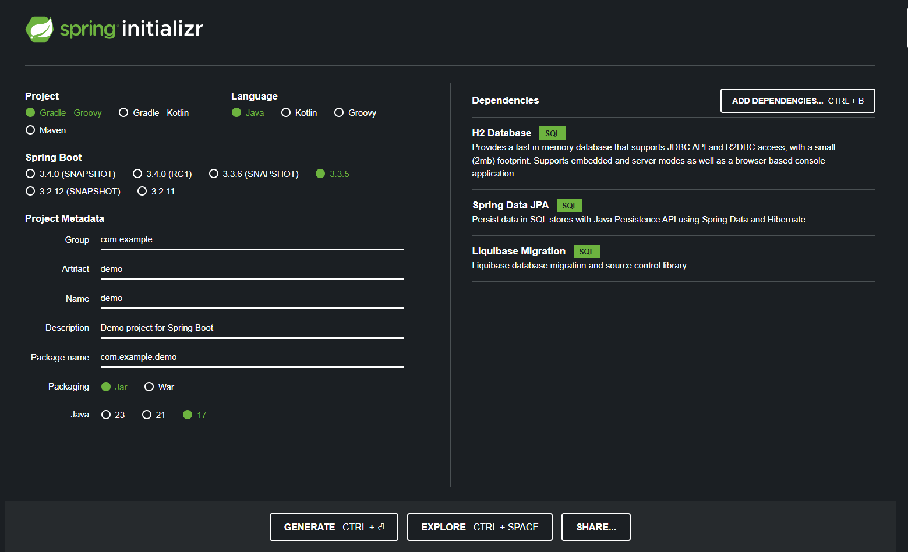

# Using Liquibase with Spring Boot

The purpose of this tutorial is to guide you through the process of using Liquibase as part of
your [Spring Boot](https://docs.spring.io/spring-boot/docs/current/reference/html/) workflow.

The Liquibase Spring Boot integration ensures the application's database is updated along with the application code by 
embedding your [changelog files](https://docs.liquibase.com/concepts/changelogs/home.html){:target="_blank}
in your application and automatically running [Liquibase update](https://docs.liquibase.com/change-types/update.html){:target="_blank"} 
as part of your application startup.

## Prerequisites

Ensure you have Java Development Kit [(JDK 17+](https://www.oracle.com/java/technologies/javase-downloads.html))

If you do not already have a Spring Boot application, you can create one with
the [Spring Initializer](https://start.spring.io):

1. Under **Project**, select **Gradle Project** or **Maven Project** depending on your preference.
2. Select Java as your **Language**.
3. Under **Spring Boot**, select the version you would like to use.
4. For **Packaging**, select **Jar**.
5. Use version 17 or later for Java.
6. Under **Dependencies**, select **Liquibase Migration**, **Spring Data JPA**, and whatever database you plan to use, such as **H2**.

       After selecting your options, the project window needs to look similar to the screenshot:

       

7. Click **GENERATE** to download your project template as a `zip` file. Extract it and open in your IDE.

## Add Liquibase

If you did not already add the Liquibase dependency when creating your project, you can add it manually by adding
`org.liquibase:liquibase-core` as a dependency to your project.

=== "Maven pom.xml"

    ``` xml
      <dependencies>
         <dependency>
             <groupId>org.liquibase</groupId>
             <artifactId>liquibase-core</artifactId>
         </dependency>
      </dependencies>
    ```

=== "Gradle build.gradle"

    ``` groovy
      dependencies {
            implementation 'org.liquibase:liquibase-core'
      }
    ```

## Add a Changelog File

Create a changelog file in your project. By default, The Spring Boot Liquibase integration looks for a file named `db.changelog-master.xml` in the `src/main/resources/db/changelog` directory.

```xml
<?xml version="1.0" encoding="UTF-8"?>
<databaseChangeLog
        xmlns="http://www.liquibase.org/xml/ns/dbchangelog"
        xmlns:xsi="http://www.w3.org/2001/XMLSchema-instance"
        xsi:schemaLocation="http://www.liquibase.org/xml/ns/dbchangelog http://www.liquibase.org/xml/ns/dbchangelog/dbchangelog-latest.xsd">

   <changeSet id="1" author="my_name">
      <createTable tableName="test_table">
         <column name="test_id" type="int">
            <constraints primaryKey="true"/>
         </column>
         <column name="test_column" type="INT"/>
      </createTable>
   </changeSet>

</databaseChangeLog>
```

## Start your Application

When you start your application with `mvn spring-boot:run` or `gradle bootRun`, Liquibase will automatically run the changelog file and update your database.

Try it now, and you should see the table `test_table` created in your database.

## Next Steps

- Looking to learn what you can do in your changelog file? Learn more in the [Liquibase documentation](https://docs.liquibase.com/concepts/changelogs/home.html){:target="_blank"}.
- [Customize Liquibase within Spring Boot](configuration.md). 
